# Bible Audio Acoustic Tokenization Pipeline

A complete pipeline for discovering acoustic units from Portuguese Bible audio and training a vocoder to synthesize speech from discrete tokens.

## Overview

This project implements an **unsupervised acoustic tokenization** system that:
1. Extracts speech representations using XLSR-53 (multilingual wav2vec2)
2. Discovers discrete acoustic units via K-Means clustering
3. Learns acoustic patterns using BPE tokenization
4. Trains a vocoder to convert units back to audio

```mermaid
flowchart TB
    subgraph Input
        A[🎵 Raw Audio<br/>Portuguese Bible<br/>~84 hours]
    end
    
    subgraph Phase1[Phase 1: Acoustic Tokenization]
        B[Convert MP3 → WAV<br/>16kHz mono]
        C[Segment by Silence<br/>18,072 segments]
        D[XLSR-53 Features<br/>Layer 14, 1024-dim]
        E[K-Means Clustering<br/>100 acoustic units]
    end
    
    subgraph Phase2[Phase 2: Pattern Discovery]
        F[Unit Sequences<br/>Integer tokens]
        G[BPE Tokenizer<br/>SentencePiece]
        H[Acoustic Motifs<br/>Recurring patterns]
    end
    
    subgraph Phase3[Phase 3: Vocoder Training]
        I[Unit + Audio Pairs]
        J[Generator<br/>320x upsampling]
        K[Discriminator<br/>Multi-scale]
        L[Synthesized Audio]
    end
    
    A --> B --> C --> D --> E
    E --> F --> G --> H
    E --> I
    C --> I
    I --> J
    J <--> K
    J --> L
    
    style A fill:#e1f5fe
    style E fill:#c8e6c9
    style H fill:#fff3e0
    style L fill:#f3e5f5
```



## Pipeline Phases

### Phase 1: Acoustic Unit Discovery

Discovers 100 discrete acoustic units from continuous speech using self-supervised representations.


**Key Parameters:**
- Model: `facebook/wav2vec2-large-xlsr-53`
- Layer: 14 (best for phonetic information)
- Clusters: 100 (balances granularity vs. trainability)
- Frame rate: ~20ms per unit (320 samples at 16kHz)

### Phase 2: BPE Motif Discovery

Discovers recurring acoustic patterns (motifs) using Byte Pair Encoding.


**What BPE discovers:**
- Common unit pairs → merged into single token
- Recurring patterns → potential phonemes/syllables
- Frequency distribution → language structure

### Phase 3: Vocoder Training

Trains a GAN-based vocoder to convert discrete units back to audio.

```mermaid
flowchart TB
    subgraph Generator
        A[Unit Sequence<br/>e.g., 50 units] --> B[Embedding<br/>100 → 256 dim]
        B --> C[Pre-Conv<br/>256 → 512]
        C --> D[Upsample 5x<br/>512 → 256]
        D --> E[Upsample 4x<br/>256 → 128]
        E --> F[Upsample 4x<br/>128 → 64]
        F --> G[Upsample 4x<br/>64 → 32]
        G --> H[Residual Blocks<br/>x3]
        H --> I[Post-Conv<br/>32 → 1]
        I --> J[Audio<br/>50 × 320 = 16,000 samples]
    end
    
    subgraph Discriminator
        K[Real/Fake Audio] --> L[Scale 1<br/>Original]
        K --> M[Scale 2<br/>2x downsample]
        K --> N[Scale 3<br/>4x downsample]
        L --> O[Real/Fake Score]
        M --> O
        N --> O
    end
    
    J --> K
```



**Architecture:**
- Upsampling: 5 × 4 × 4 × 4 = 320x (matches XLSR-53 frame rate)
- Generator: 3.2M parameters
- Discriminator: Multi-scale (3 scales)
- Loss: Mel spectrogram L1 + Adversarial

## Project Structure

```
model-training/
├── src/
│   ├── models/          # Model architectures
│   │   ├── generator.py
│   │   └── discriminator.py
│   ├── training/        # Training logic
│   │   ├── phase1_acoustic.py
│   │   ├── phase2_bpe.py
│   │   └── phase3_vocoder.py
│   └── data/            # Data processing
│       ├── audio_utils.py
│       └── dataset.py
├── scripts/             # CLI utilities
│   ├── segment_audio.py
│   ├── upload_to_modal.py
│   └── download_results.py
├── notebooks/           # Jupytext notebooks (.py)
│   └── analyze_results.py
├── docs/                # Documentation
│   ├── ARCHITECTURE.md
│   └── PIPELINE.md
├── modal_downloads/     # Downloaded results
│   ├── phase1_outputs/
│   ├── phase2_outputs/
│   └── vocoder_test/
└── README.md
```

## Quick Start

### Prerequisites

```bash
pip install modal torch torchaudio transformers scikit-learn sentencepiece tqdm
python3 -m modal token set --token-id <your-id> --token-secret <your-secret>
```

### Run Pipeline

```bash
# Phase 1: Segment audio locally, upload to Modal
python3 scripts/segment_audio.py
python3 -m modal run scripts/upload_to_modal.py

# Phase 1: Run acoustic tokenization on Modal
python3 -m modal run --detach src/training/phase1_acoustic.py

# Phase 2: Train BPE on acoustic units
python3 -m modal run --detach src/training/phase2_bpe.py

# Phase 3: Train vocoder
python3 -m modal run --detach src/training/phase3_vocoder.py

# Test vocoder quality
python3 -m modal run src/training/vocoder_test.py
```

## Results

### Dataset Statistics

| Metric | Value |
|--------|-------|
| Source | Portuguese Bible (Old + New Testament) |
| Total Duration | ~84 hours |
| Segments | 18,072 |
| Acoustic Units | 100 clusters |
| BPE Vocabulary | 100 motifs |

### Training Results

| Phase | Epochs | Best Metric |
|-------|--------|-------------|
| Phase 1 | N/A (K-Means) | 100 clusters, ~15M tokens |
| Phase 2 | N/A (BPE) | 100 motifs discovered |
| Phase 3 | 373 | Mel Loss: 81.2 |

### Vocoder Quality

| Metric | Value | Interpretation |
|--------|-------|----------------|
| SNR | -1.95 dB | Reconstruction differs from original |
| MCD | 96.4 | Acceptable for proof-of-concept |
| Length Match | 100% | ✓ Correct timing (320x upsampling) |

## Architecture Deep Dive

See [docs/ARCHITECTURE.md](docs/ARCHITECTURE.md) for detailed explanations of:
- XLSR-53 feature extraction
- K-Means clustering strategy
- Generator/Discriminator design
- Loss functions and training dynamics

## Known Limitations

1. **Vocoder Quality**: Current model produces robotic audio due to:
   - Information loss in 100-unit quantization
   - Discriminator collapse (D loss → 0)
   - Missing pitch/F0 conditioning

2. **Improvements Needed**:
   - HiFi-GAN architecture for better quality
   - Multi-resolution STFT loss
   - Pitch conditioning from original audio

## License

Private - shemaobt organization only.

## References

- [wav2vec 2.0](https://arxiv.org/abs/2006.11477) - Self-supervised speech representations
- [XLSR-53](https://arxiv.org/abs/2006.13979) - Cross-lingual speech representations
- [HiFi-GAN](https://arxiv.org/abs/2010.05646) - High-fidelity vocoder architecture
- [SentencePiece](https://github.com/google/sentencepiece) - BPE tokenization
