# Bible Audio Acoustic Tokenization & Vocoder

A machine learning pipeline for **unsupervised speech representation learning**. This project converts continuous speech (specifically the Bible) into discrete acoustic tokens and learns to resynthesize speech from those tokens.

The goal is to enable NLP-like capabilities (translation, search, pattern discovery) directly on audio data for low-resource languages (like Sateré-Mawé).

## 🧠 Core Concept

Traditional speech processing relies on text transcripts (ASR). We don't.
We use **Self-Supervised Learning** to discover the "units" of a language purely from audio.

```mermaid
flowchart LR
    subgraph Input
        A[🗣️ Raw Audio]
    end

    subgraph Discretization
        B[XLSR-53<br/>Features] --> C[K-Means<br/>Clustering] --> D[Discrete Tokens<br/>31 87 14...]
    end

    subgraph Applications
        D --> E["Language Modeling<br/>(BPE, GPT)"]
        D --> F["Vocoder<br/>(Synthesis)"]
    end

    A --> B
    F --> G[🗣️ Resynthesized Audio]
    
    style D fill:#f9f,stroke:#333,stroke-width:2px
```



## 🏗️ Pipeline Architecture

The pipeline consists of three distinct training phases.

### Phase 1: Acoustic Tokenization
Extracts features from audio and learns a discrete vocabulary of 100 sounds.


### Phase 2: Pattern Discovery (BPE)
Analyzes the sequence of units to find recurring motifs (acoustic "words").


### Phase 3: Vocoder (Synthesis)
Trains a generative model to convert discrete units back into continuous audio waveforms.


## 🚀 Quick Start

### Prerequisites
- Python 3.10+
- Modal account (for cloud GPU training)
- `ffmpeg` installed locally

### Installation
```bash
pip install -r requirements.txt
python3 -m modal token set --token-id <id> --token-secret <secret>
```

### Execution Flow

**1. Segment Audio Locally** (Generic support for multiple languages)
```bash
# For Portuguese
python scripts/segment_audio.py --language portuguese

# For Sateré-Mawé
python scripts/segment_audio.py --language satere
```

**2. Upload to Cloud Storage**
```bash
python3 -m modal run scripts/upload_to_modal.py --language satere
```

**3. Run Training Pipeline (on Modal)**
```bash
# Phase 1: Discover acoustic units
python3 -m modal run --detach src/training/phase1_acoustic.py

# Phase 2: Learn motifs (BPE)
python3 -m modal run --detach src/training/phase2_bpe.py

# Phase 3: Train Vocoder (Original - simpler, faster)
python3 -m modal run --detach src/training/phase3_vocoder.py

# Phase 3 V2: Train Enhanced Vocoder (recommended for quality)
python3 -m modal run --detach src/training/phase3_vocoder_v2.py
```

## 🎯 V2 Vocoder (Enhanced)

The V2 vocoder addresses the "robotic audio" problem with several improvements:

### Key Improvements
- **Pitch Conditioning**: Extracts F0 and conditions generator on pitch for natural prosody
- **HiFi-GAN Architecture**: Multi-Receptive Field Fusion in generator
- **MPD + MSD Discriminators**: Multi-Period + Multi-Scale for comprehensive quality control
- **Enhanced Losses**: Mel + Multi-STFT + Feature Matching + Adversarial
- **Spectral Normalization**: Prevents discriminator collapse
- **2-Second Segments**: Better prosody learning (vs 1-second in V1)

### V2 Training
```bash
# Full training with all improvements
python3 -m modal run --detach src/training/phase3_vocoder_v2.py::main

# Custom parameters
python3 -m modal run --detach src/training/phase3_vocoder_v2.py::main \
    --epochs 1000 --segment-length 32000 --patience 100

# Resume training
python3 -m modal run --detach src/training/phase3_vocoder_v2.py::main --resume v2_latest.pt
```

### V2 Testing
```bash
# Test quality metrics
python3 -m modal run src/training/vocoder_test_v2.py::main --num-samples 50

# Download results
modal volume get bible-audio-data vocoder_v2_test_output/ ./modal_downloads/vocoder_v2_test/
```

**Documentation:**
- [docs/VOCODER_V2_ARCHITECTURE.md](docs/VOCODER_V2_ARCHITECTURE.md) - Complete V2 technical guide with diagrams
- [docs/ROBOTIC_AUDIO_ANALYSIS.md](docs/ROBOTIC_AUDIO_ANALYSIS.md) - Why V1 sounds robotic + solutions

## 📂 Project Structure

```
model-training/
├── src/
│   ├── models/                    # Neural Network Architectures (Jupytext)
│   │   ├── generator.py           # V1 Vocoder (basic upsampling)
│   │   ├── generator_v2.py        # V2 Vocoder (HiFi-GAN + pitch conditioning)
│   │   ├── discriminator.py       # V1 Multi-Scale Discriminator
│   │   └── discriminator_v2.py    # V2 MPD + MSD with spectral norm
│   ├── training/                  # Cloud Training Scripts
│   │   ├── phase1_acoustic.py     # Feature extraction & clustering
│   │   ├── phase2_bpe.py          # BPE motif discovery
│   │   ├── phase3_vocoder.py      # V1 GAN training (simpler)
│   │   ├── phase3_vocoder_v2.py   # V2 GAN training (enhanced)
│   │   ├── vocoder_test.py        # V1 quality testing
│   │   ├── vocoder_test_v2.py     # V2 quality testing with F0
│   │   └── validate_units.py      # Unit validation
├── scripts/                       # Local Utilities
│   ├── segment_audio.py           # Silence-based segmentation
│   └── upload_to_modal.py         # Data transfer
├── docs/
│   ├── ARCHITECTURE.md            # V1 design decisions
│   ├── VOCODER_V2_ARCHITECTURE.md # V2 complete technical guide
│   ├── ROBOTIC_AUDIO_ANALYSIS.md  # Why V1 sounds robotic + solutions
│   ├── SEGMENT_PREPARATION.md     # Segment size impact on training
│   └── PIPELINE.md                # Step-by-step manual
└── audio_data/                    # Raw input files (gitignored)
```

## 🔬 Design Decisions & Trade-offs

See [docs/ARCHITECTURE.md](docs/ARCHITECTURE.md) for a comprehensive analysis.

**Key Highlights:**
- **Why 100 Units?** Balanced trade-off between phonetic granularity and model trainability.
- **Why Layer 14?** Best layer in XLSR-53 for phonetic content, filtering out speaker identity.
- **Why Robotic Audio (V1)?** We deliberately discarded pitch (F0) to focus on phonetic content.
- **V2 Solution:** Re-injects pitch via conditioning, uses HiFi-GAN architecture and enhanced losses.

## 📊 Results

### V1 Vocoder
- **Compression:** ~775x reduction in bitrate (Raw Audio → Discrete Tokens).
- **Intelligibility:** High. The vocoder successfully reconstructs words from tokens.
- **Naturalness:** Low. Prosody is flat due to F0 loss.

### V2 Vocoder (Expected)
- **Intelligibility:** High. Same phonetic reconstruction.
- **Naturalness:** Medium-High. Pitch conditioning restores prosody.
- **F0 Accuracy:** < 20 Hz RMSE (good pitch tracking).
- **MCD:** < 5.0 (good spectral quality).

## License
Private - shemaobt organization.
