# Bible Audio Acoustic Tokenization & Vocoder

A machine learning pipeline for **unsupervised speech representation learning**. This project converts continuous speech (specifically the Bible) into discrete acoustic tokens and learns to resynthesize speech from those tokens.

The goal is to enable NLP-like capabilities (translation, search, pattern discovery) directly on audio data for low-resource languages (like Sateré-Mawé).

## 🧠 Core Concept

Traditional speech processing relies on text transcripts (ASR). We don't.
We use **Self-Supervised Learning** to discover the "units" of a language purely from audio.

```mermaid
flowchart LR
    subgraph Input
        A[🗣️ Raw Audio]
    end

    subgraph Discretization
        B[XLSR-53<br/>Features] --> C[K-Means<br/>Clustering] --> D[Discrete Tokens<br/>31 87 14...]
    end

    subgraph Applications
        D --> E["Language Modeling<br/>(BPE, GPT)"]
        D --> F["Vocoder<br/>(Synthesis)"]
    end

    A --> B
    F --> G[🗣️ Resynthesized Audio]
    
    style D fill:#f9f,stroke:#333,stroke-width:2px
```



## 🎯 What This Pipeline Produces

After completing all 3 phases, you have a **Speech Synthesis (Vocoder) System** for the target language.

```mermaid
flowchart LR
    subgraph Input
        A[Acoustic Units<br/>31 87 14 43...]
    end
    
    subgraph TrainedModel ["Trained Vocoder (Phase 3)"]
        B[Generator V2<br/>HiFi-GAN + Pitch]
    end
    
    subgraph Output
        C[🔊 Natural Audio<br/>16kHz WAV]
    end
    
    A --> B --> C
    
    style B fill:#f9f,stroke:#333,stroke-width:2px
```



### Phase Outputs

| Phase | Output | Purpose |
|-------|--------|---------|
| **Phase 1** | K-Means model + Unit sequences | Creates a "vocabulary" of ~100 speech sounds (learned phonemes) |
| **Phase 2** | BPE tokenizer + Motif analysis | Discovers common sound patterns (optional, for linguistic analysis) |
| **Phase 3** | **Vocoder model** (.pt file) | Neural network that converts unit sequences → audio waveforms |

### Use Cases

#### 1. Speech-to-Speech Translation
```
Source Audio → ASR → Translation → Unit Prediction → [Your Vocoder] → Target Audio
                                                          ↑
                                                    (This is what you train)
```
Translate from Portuguese to Sateré, then synthesize natural Sateré speech.

#### 2. Voice Preservation for Endangered Languages
- Train on native speaker recordings → Generate new speech in that voice/language
- Preserve acoustic characteristics of indigenous languages like Sateré-Mawé

#### 3. Audio Bible Generation
- Convert text (via text-to-unit model) → audio narration in the target language
- Generate consistent, natural-sounding Bible readings

#### 4. Low-Resource TTS Foundation
- The vocoder is the acoustic backend for any TTS system
- Pair with a Text-to-Unit model for complete text-to-speech

### What's Needed for Full TTS?

This pipeline trains the **acoustic model (vocoder)**: `Units → Audio`

For complete **Text → Speech**, you also need: `Text → Units` (not included here)

Options for Text-to-Unit:
- Tacotron-style sequence-to-sequence model
- Translation model that outputs units instead of text
- GPT-style language model trained on unit sequences

## 🏗️ Pipeline Architecture

The pipeline consists of three distinct training phases.

### Phase 1: Acoustic Tokenization
Extracts features from audio and learns a discrete vocabulary of 100 sounds.


> **Note**: We use **MMS-300M** (Massively Multilingual Speech) as the default feature extractor, which provides better representation for low-resource languages than the legacy XLSR-53. You can still switch to XLSR-53 using the `--model` flag. See [docs/MMS_VS_XLSR53.md](docs/MMS_VS_XLSR53.md) for details.

### Phase 2: Pattern Discovery (BPE)
Analyzes the sequence of units to find recurring motifs (acoustic "words").


### Phase 3: Vocoder (Synthesis)
Trains a generative model to convert discrete units back into continuous audio waveforms.


## 🚀 Quick Start

### Prerequisites
- Python 3.10+
- Modal account (for cloud GPU training)
- `ffmpeg` installed locally

### Installation
```bash
pip install -r requirements.txt
python3 -m modal token set --token-id <id> --token-secret <secret>
```

### Execution Flow

**1. Segment Audio Locally** (one-time, run on your machine)
```bash
# For Portuguese
python scripts/segment_audio.py --language portuguese

# For Sateré-Mawé
python scripts/segment_audio.py --language satere
```

**2. Upload to Cloud Storage** (one-time, run on your machine)
```bash
python3 -m modal run scripts/upload_to_modal.py --language portuguese
```

**3. Run Training Pipeline (on Modal)**

#### Option A: Run All Phases at Once (Recommended)
```bash
# Run full pipeline with V2 vocoder (best quality)
python3 -m modal run src/training/run_full_pipeline.py::main

# Run full pipeline with V1 vocoder (faster, simpler)
python3 -m modal run src/training/run_full_pipeline.py::main --vocoder-version v1
```

#### Option B: Run Phases Individually
```bash
# Phase 1: Discover acoustic units (~2-4 hours)
# Default: MMS-300M
python3 -m modal run --detach src/training/phase1_acoustic.py

# OR use legacy XLSR-53
python3 -m modal run --detach src/training/phase1_acoustic.py --model xlsr-53

# Phase 2: Learn motifs/BPE (~30 min)
python3 -m modal run --detach src/training/phase2_bpe.py

# Phase 3 V2: Train Enhanced Vocoder (~4-8 hours) ⭐ RECOMMENDED
python3 -m modal run --detach src/training/phase3_vocoder_v2.py

# OR Phase 3 V1: Train Original Vocoder (~2-4 hours)
python3 -m modal run --detach src/training/phase3_vocoder.py
```

#### Option C: Run Only Specific Phases
```bash
# Skip Phase 1 (already done), run 2 and 3
python3 -m modal run src/training/run_full_pipeline.py::main --phases 2,3

# Run only vocoder training (Phases 1 & 2 already done)
python3 -m modal run src/training/run_full_pipeline.py::main --phases 3
```

## 🌍 Multi-Language Support

All training scripts support multiple languages via the `--language` parameter.

### Supported Languages

| Language | Code | Segmented Audio | Units Output | Vocoder Checkpoints |
|----------|------|-----------------|--------------|---------------------|
| Portuguese | `portuguese` | `segmented_audio/` | `portuguese_units/` | `vocoder_v2_checkpoints/` |
| Sateré-Mawé | `satere` | `segmented_audio_satere/` | `satere_units/` | `vocoder_v2_satere_checkpoints/` |

### Training a New Language

```bash
# 1. Segment locally
python scripts/segment_audio.py --language satere

# 2. Upload to Modal
python3 -m modal run scripts/upload_to_modal.py --language satere

# 3. Run full pipeline for Sateré
python3 -m modal run src/training/run_full_pipeline.py::main --language satere

# OR run phases individually
python3 -m modal run --detach src/training/phase1_acoustic.py::main_skip_segmentation --language satere
python3 -m modal run --detach src/training/phase2_bpe.py::main --language satere
python3 -m modal run --detach src/training/phase3_vocoder_v2.py::main --language satere
```

### Testing & Downloading Results

```bash
# Test Sateré vocoder
python3 -m modal run src/training/vocoder_test_v2.py::main --language satere --num-samples 50

# Download Sateré checkpoints
modal volume get bible-audio-data vocoder_v2_satere_checkpoints/ ./modal_downloads/vocoder_v2_satere/

# Download test results
modal volume get bible-audio-data vocoder_v2_satere_test_output/ ./modal_downloads/vocoder_v2_satere_test/
```

### Adding a New Language

To add support for a new language, update the `LANGUAGE_CONFIGS` dictionary in each training script:

```python
LANGUAGE_CONFIGS = {
    # ... existing languages ...
    "new_language": {
        "segmented_dir": f"{AUDIO_MOUNT}/segmented_audio_new",
        "output_dir": f"{AUDIO_MOUNT}/new_language_units",
        "vocoder_dir": f"{AUDIO_MOUNT}/vocoder_v2_new_checkpoints",
        "corpus_file": "new_language_corpus_timestamped.json",
    },
}
```

## 🎯 V2 Vocoder (Enhanced)

The V2 vocoder addresses the "robotic audio" problem with several improvements.

> **Note**: V2 only affects **Phase 3** (vocoder training). Phases 1 and 2 remain the same.
> You must run Phases 1 and 2 first before training V2.

### Prerequisites for V2
```bash
# Ensure Phases 1 and 2 are complete (check Modal volume)
modal volume ls bible-audio-data portuguese_units/
# Should show: portuguese_kmeans.pkl, all_units_for_bpe.txt, portuguese_corpus_timestamped.json
```

### Key Improvements
| Feature | V1 | V2 |
|---------|----|----|
| Pitch conditioning | ❌ | ✅ 32-bin F0 embedding |
| Generator | Simple TransConv | HiFi-GAN with MRF |
| Discriminator | MSD only | MPD + MSD |
| Losses | Mel + Adversarial | Mel + STFT + FM + Adversarial |
| Segment length | 1 second | 2 seconds |
| Audio quality | Robotic | Natural prosody |

### V2 Training Commands
```bash
# RECOMMENDED: Full pipeline with V2
python3 -m modal run src/training/run_full_pipeline.py::main

# OR: Only V2 vocoder (if Phases 1 & 2 done)
python3 -m modal run --detach src/training/phase3_vocoder_v2.py::main

# Custom parameters
python3 -m modal run --detach src/training/phase3_vocoder_v2.py::main \
    --epochs 1000 --segment-length 32000 --patience 100

# Resume training from checkpoint
python3 -m modal run --detach src/training/phase3_vocoder_v2.py::main --resume v2_latest.pt
```

### V2 Testing
```bash
# Test quality metrics (after training)
python3 -m modal run src/training/vocoder_test_v2.py::main --num-samples 50

# Download test results
modal volume get bible-audio-data vocoder_v2_test_output/ ./modal_downloads/vocoder_v2_test/
```

### V2 Documentation
- [docs/VOCODER_V2_ARCHITECTURE.md](docs/VOCODER_V2_ARCHITECTURE.md) - Complete technical guide with diagrams
- [docs/ROBOTIC_AUDIO_ANALYSIS.md](docs/ROBOTIC_AUDIO_ANALYSIS.md) - Why V1 sounds robotic + solutions
- [docs/SEGMENT_PREPARATION.md](docs/SEGMENT_PREPARATION.md) - Segment size impact and recommendations

## 📂 Project Structure

```
model-training/
├── src/
│   ├── models/                    # Neural Network Architectures (Jupytext)
│   │   ├── generator.py           # V1 Vocoder (basic upsampling)
│   │   ├── generator_v2.py        # V2 Vocoder (HiFi-GAN + pitch conditioning)
│   │   ├── discriminator.py       # V1 Multi-Scale Discriminator
│   │   └── discriminator_v2.py    # V2 MPD + MSD with spectral norm
│   ├── training/                  # Cloud Training Scripts
│   │   ├── run_full_pipeline.py   # 🚀 Run all phases at once
│   │   ├── phase1_acoustic.py     # Feature extraction & clustering
│   │   ├── phase2_bpe.py          # BPE motif discovery
│   │   ├── phase3_vocoder.py      # V1 GAN training (simpler)
│   │   ├── phase3_vocoder_v2.py   # V2 GAN training (enhanced)
│   │   ├── vocoder_test.py        # V1 quality testing
│   │   ├── vocoder_test_v2.py     # V2 quality testing with F0
│   │   └── validate_units.py      # Unit validation
├── scripts/                       # Local Utilities
│   ├── segment_audio.py           # Silence-based segmentation
│   └── upload_to_modal.py         # Data transfer
├── docs/
│   ├── ARCHITECTURE.md            # V1 design decisions
│   ├── VOCODER_V2_ARCHITECTURE.md # V2 complete technical guide
│   ├── ROBOTIC_AUDIO_ANALYSIS.md  # Why V1 sounds robotic + solutions
│   ├── SEGMENT_PREPARATION.md     # Segment size impact on training
│   ├── MMS_VS_XLSR53.md           # MMS vs XLSR-53 comparison & migration
│   ├── AUDIOLM_INTEGRATION.md     # AudioLM architecture & integration guide
│   └── PIPELINE.md                # Step-by-step manual
└── audio_data/                    # Raw input files (gitignored)
```

## 🔬 Design Decisions & Trade-offs

See [docs/ARCHITECTURE.md](docs/ARCHITECTURE.md) for a comprehensive analysis.

**Key Highlights:**
- **Why 100 Units?** Balanced trade-off between phonetic granularity and model trainability.
- **Why Layer 14?** Best layer in XLSR-53 for phonetic content, filtering out speaker identity.
- **Why Robotic Audio (V1)?** We deliberately discarded pitch (F0) to focus on phonetic content.
- **V2 Solution:** Re-injects pitch via conditioning, uses HiFi-GAN architecture and enhanced losses.

### Future Directions

| Technology | Document | Potential Benefit |
|------------|----------|-------------------|
| **MMS** (Meta) | [MMS_VS_XLSR53.md](docs/MMS_VS_XLSR53.md) | Better low-resource language support (1,400+ languages) |
| **AudioLM** (Google) | [AUDIOLM_INTEGRATION.md](docs/AUDIOLM_INTEGRATION.md) | State-of-the-art quality via semantic + acoustic tokens |

These documents provide deep technical analysis of how emerging architectures could enhance our pipeline.

## 📊 Results

### V1 Vocoder
- **Compression:** ~775x reduction in bitrate (Raw Audio → Discrete Tokens).
- **Intelligibility:** High. The vocoder successfully reconstructs words from tokens.
- **Naturalness:** Low. Prosody is flat due to F0 loss.

### V2 Vocoder (Expected)
- **Intelligibility:** High. Same phonetic reconstruction.
- **Naturalness:** Medium-High. Pitch conditioning restores prosody.
- **F0 Accuracy:** < 20 Hz RMSE (good pitch tracking).
- **MCD:** < 5.0 (good spectral quality).

## License
Private - shemaobt organization.
