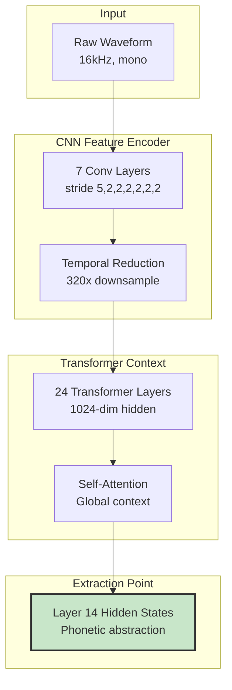
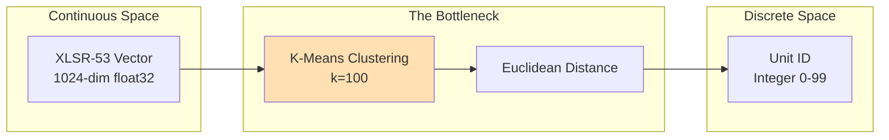
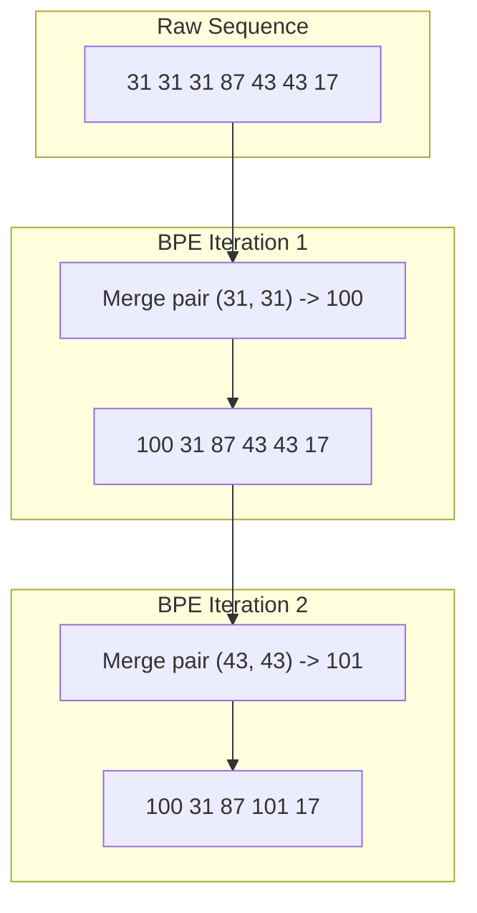
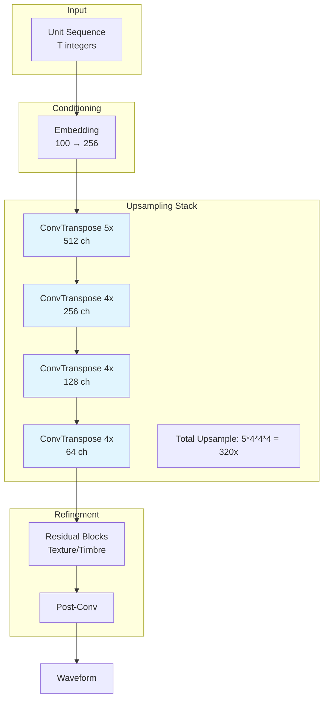
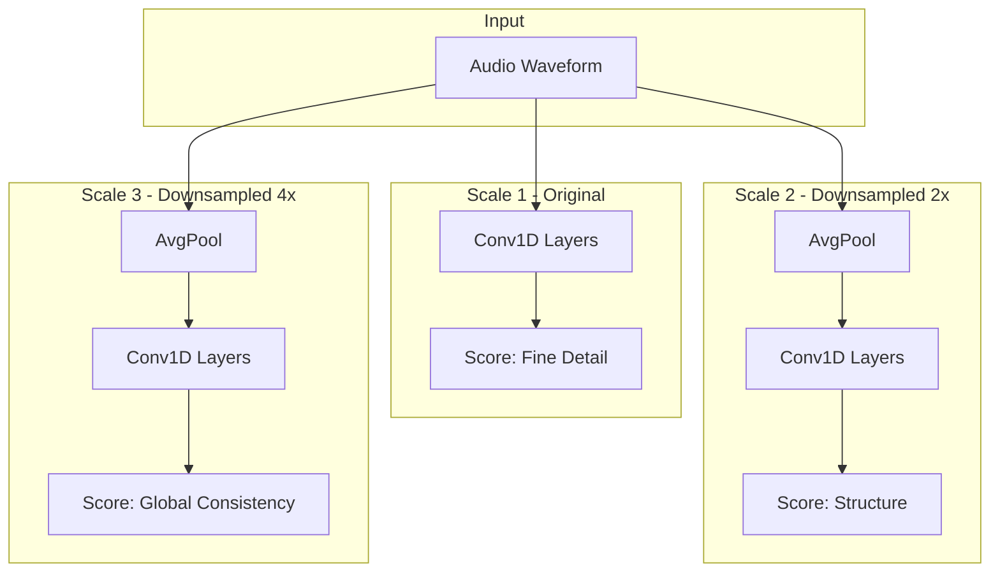
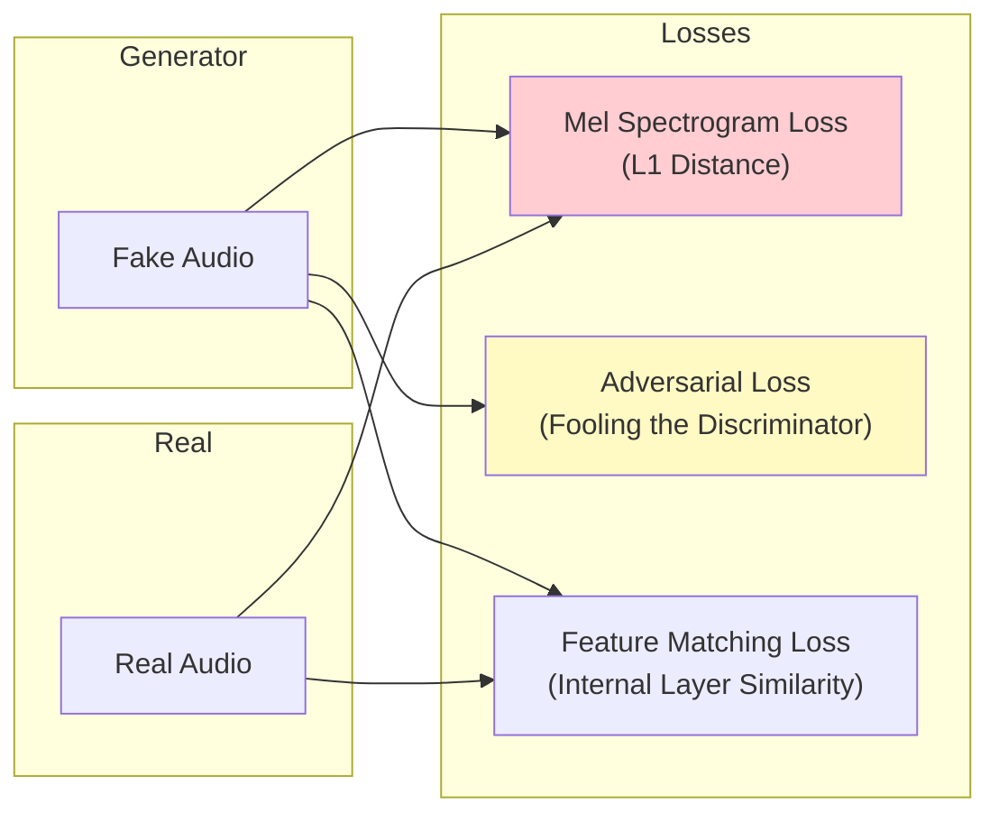

# Architecture Deep Dive & Design Decisions

This document provides a comprehensive technical analysis of the models, algorithms, and architectural decisions in the acoustic tokenization pipeline. It combines structural diagrams with a critical look at the trade-offs involved in unsupervised speech representation.

## Table of Contents

1. [XLSR-53 Feature Extraction](#xlsr-53-feature-extraction)
2. [K-Means Acoustic Clustering](#k-means-acoustic-clustering)
3. [BPE Motif Discovery](#bpe-motif-discovery)
4. [Vocoder Architecture](#vocoder-architecture)
5. [Training Dynamics & Loss](#training-dynamics--loss)

---

## XLSR-53 Feature Extraction

### The Model: wav2vec 2.0 (XLSR-53)

We use `facebook/wav2vec2-large-xlsr-53`, a model pre-trained on 53 languages using contrastive learning. Unlike ASR models, it is **self-supervised**, meaning it learned the structure of speech from raw audio without any text labels.



### Design Decision: Layer 14 Selection

**The Choice:** We extract features specifically from **Layer 14** (of 24).

**Justification:**
Deep learning models learn features hierarchically. In wav2vec 2.0, empirical analysis shows:
- **Layers 1-6 (Acoustic):** Encode raw signal properties (pitch, energy, speaker timbre).
- **Layers 7-12 (Sub-phonetic):** Capture transient articulation details.
- **Layers 13-18 (Phonemic):** **The "Goldilocks" Zone.** These layers have the highest mutual information with phone boundaries across languages. They abstract away *who* is speaking to focus on *what* is being said.
- **Layers 19-24 (Semantic):** Encode word-level context, often overfitting to the languages seen during pre-training.

**Trade-off:**
- **Upside:** Strong robustness to different speakers and noise.
- **Downside:** Loss of prosody (intonation, rhythm). This is a primary cause of the "flat" robotic tone in synthesis.

### Technical Spec: Frame Rate
The model downsamples audio by a factor of 320.
```
1 sec audio = 16,000 samples
16,000 / 320 = 50 frames per second
Frame duration = 20ms
```
Each vector represents 20ms of speech context.

---

## K-Means Acoustic Clustering

### The Concept: Quantization

We transform continuous, high-dimensional vectors into a small set of discrete integers (tokens).



### Design Decision: k=100 Clusters

**The Choice:** We set `k=100`, creating a vocabulary of 100 distinct acoustic units.

**Justification:**
Human languages typically have 30-50 phonemes. However, the continuous nature of speech includes allophones (variations of a sound) and transitions (co-articulation).
- **k=100** provides enough capacity to cover the core phonemes plus common variations, without becoming so granular that every speaker's unique pronunciation gets its own token.

**The Information Bottleneck (Trade-off):**
This is the most destructive step in the pipeline.
- **Input:** 1024 floats × 32 bits = 32,768 bits/frame
- **Output:** 1 integer (0-99) ≈ 7 bits/frame
- **Compression Ratio:** ~4,600:1 (in feature space)

This extreme compression forces the model to discard everything except the most salient phonetic information. It is why we can perform "translation" later (it acts like text), but it's also why exact audio reconstruction is impossible.

---

## BPE Motif Discovery

### The Concept: Temporal Chunking

Raw 20ms frames are too short to be meaningful. A single vowel might last 200ms (10 frames). We use **Byte Pair Encoding (BPE)** to group these into longer, meaningful sequences.



### Design Decision: Unsupervised Pattern Finding

**Why BPE?**
We don't know the language's grammar or vocabulary. BPE is purely statistical—it finds patterns that appear frequently.
- **Upside:** It automatically discovers "acoustic sub-words" (syllables, common transitions) for any language.
- **Downside:** The discovered units are not guaranteed to align with linguistic boundaries (morphemes). A motif might be "end of vowel + start of consonant."

---

## Vocoder Architecture

To validate our tokens, we must prove they contain speech content by turning them back into audio.

### Generator (Unit-to-Waveform)

The Generator must invent 320 audio samples for every 1 discrete input token.



**Architecture Justification:**
We use a stack of Transposed Convolutions. The strides (5, 4, 4, 4) are carefully chosen because their product ($5 \times 4 \times 4 \times 4 = 320$) exactly matches the downsampling rate of XLSR-53. This ensures the output audio duration matches the input duration perfectly.

### Discriminator (Quality Control)

A Generative Adversarial Network (GAN) requires a Discriminator to judge the quality of the output. We use a **Multi-Scale Discriminator**.



**Why Multi-Scale?**
- **Scale 1** forces the generator to eliminate high-frequency noise (hissing/static).
- **Scales 2 & 3** force the generator to maintain the correct rhythm and envelope of the speech over longer timeframes.

---

## Training Dynamics & Loss

### Loss Function Strategy

We don't trust a single metric. We use a composite loss function to guide the training.



1.  **Mel Spectrogram Loss (The Stabilizer):** L1 distance between the spectrograms of real and fake audio. This ensures the generator gets the "content" (phonemes) right, even if the "style" is off.
2.  **Adversarial Loss (The Refiner):** Signals from the discriminator. This forces the output to sound "realistic" rather than just mathematically close.

### Analysis of "Robotic" Audio

The synthesized audio is intelligible but monotonic (robotic). This is a direct consequence of our design decisions:

1.  **Pitch Deletion:** XLSR-53 Layer 14 is invariant to pitch. The token for "A" is the same whether spoken in a deep voice or a high falsetto.
2.  **The Vocoder's Dilemma:** The vocoder receives the token "A" but has no information about the pitch. It essentially defaults to a "mean" pitch, resulting in a flat intonation.

**Solution (Future Work):**
We need to re-inject pitch information.
1.  Extract Pitch (F0) from the source audio.
2.  Quantize F0 into discrete bins.
3.  Feed `(Unit_ID, Pitch_ID)` tuples to the Vocoder.
