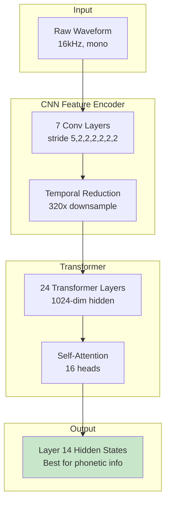
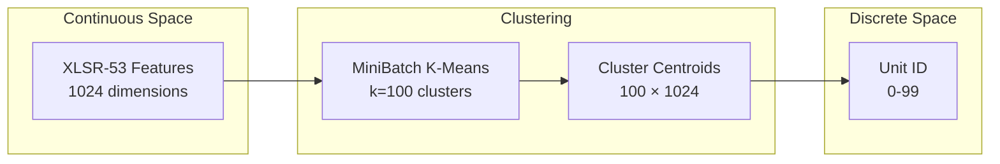
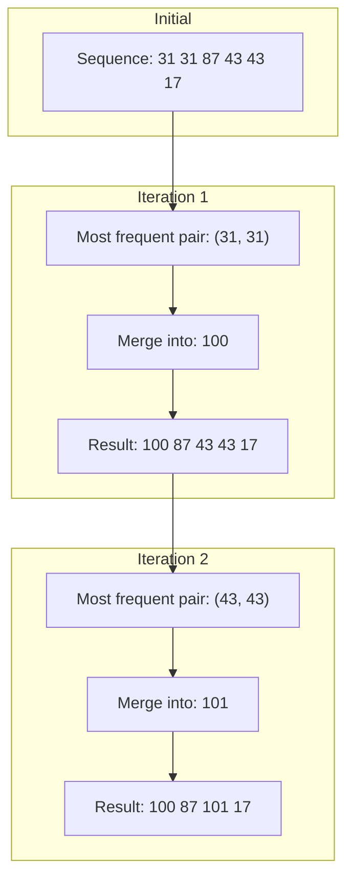
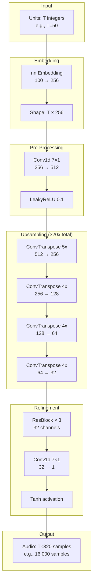
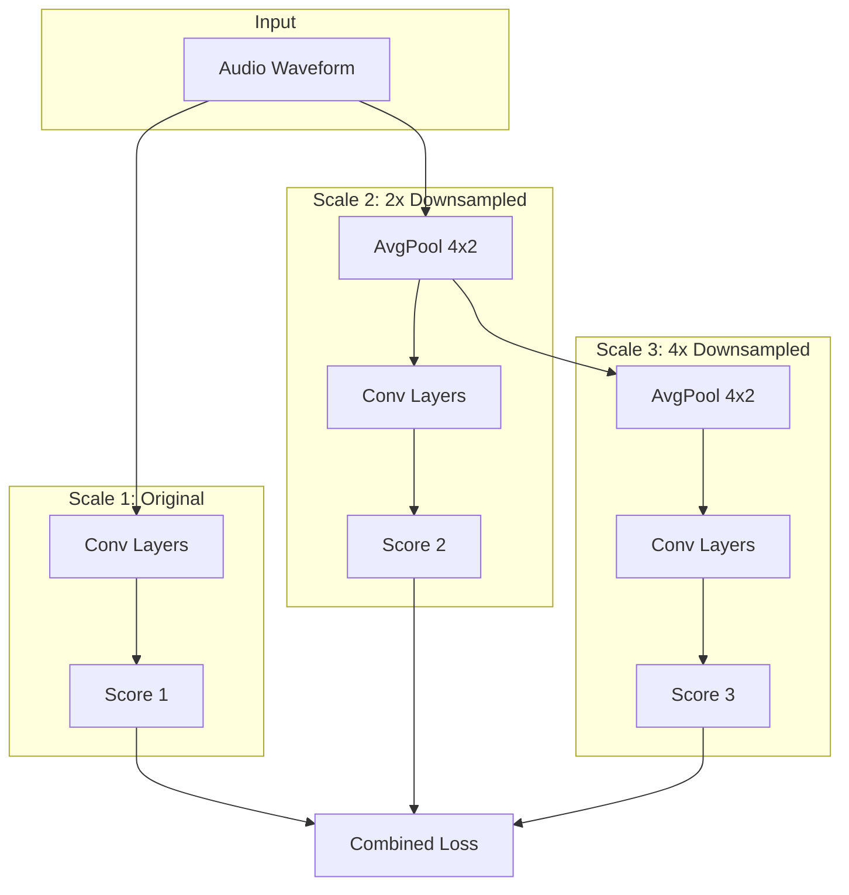
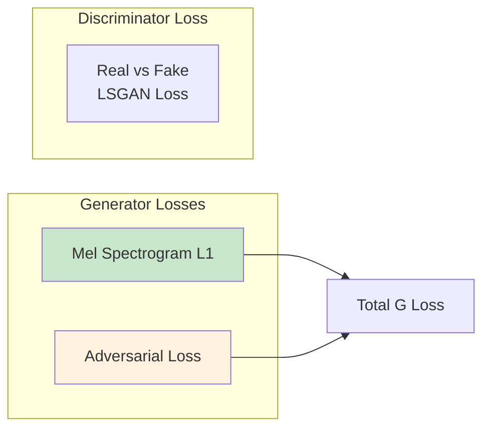
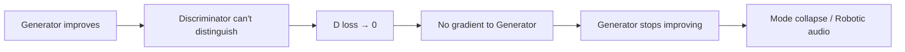

# Architecture Deep Dive

This document provides detailed explanations of the models and algorithms used in the acoustic tokenization pipeline.

## Table of Contents

1. [XLSR-53 Feature Extraction](#xlsr-53-feature-extraction)
2. [K-Means Acoustic Clustering](#k-means-acoustic-clustering)
3. [BPE Motif Discovery](#bpe-motif-discovery)
4. [Vocoder Architecture](#vocoder-architecture)
5. [Training Dynamics](#training-dynamics)

---

## XLSR-53 Feature Extraction

### What is XLSR-53?

XLSR-53 (Cross-Lingual Speech Representations) is a wav2vec 2.0 model pre-trained on 53 languages. It learns universal speech representations without any transcription.



### Why Layer 14?

Research shows different layers capture different information:

| Layers | Information Type |
|--------|------------------|
| 1-6 | Acoustic features (pitch, energy) |
| 7-12 | Phonetic features (consonants, vowels) |
| **13-18** | **Phonemic features (language-specific sounds)** |
| 19-24 | Semantic features (word-level) |

Layer 14 provides the best balance for discovering **language-independent phonetic units**.

### Frame Rate Calculation

```
Input: 1 second of audio = 16,000 samples
CNN stride: 5 × 2 × 2 × 2 × 2 × 2 × 2 = 320
Output: 16,000 / 320 = 50 frames per second
Frame duration: 1000ms / 50 = 20ms per frame
```

Each acoustic unit represents approximately **20ms of speech**.

---

## K-Means Acoustic Clustering

### Why K-Means?

K-Means provides a simple, deterministic mapping from continuous features to discrete units:



### Choosing k=100

The number of clusters affects the trade-off between:

| k Value | Granularity | Training | Coverage |
|---------|-------------|----------|----------|
| 50 | Coarse | Easy | May merge distinct sounds |
| **100** | **Balanced** | **Good** | **~phoneme level** |
| 200 | Fine | Harder | May split similar sounds |
| 500 | Very fine | Difficult | Sparse data per cluster |

100 clusters approximates the number of phonemes across languages (~44 in English, ~33 in Portuguese), making it suitable for phonetic-level tokenization.

### MiniBatch K-Means

We use MiniBatch K-Means instead of standard K-Means for efficiency:

```python
MiniBatchKMeans(
    n_clusters=100,
    batch_size=10000,      # Process 10k samples at a time
    max_iter=100,          # 100 iterations
    random_state=42,       # Reproducibility
    n_init=3               # 3 random initializations
)
```

This allows processing ~15 million feature vectors efficiently.

---

## BPE Motif Discovery

### What is BPE?

Byte Pair Encoding iteratively merges the most frequent pairs of tokens:



### Motif Interpretation

BPE discovers recurring patterns that may correspond to:

| Pattern Type | Example | Linguistic Meaning |
|--------------|---------|-------------------|
| Unit pairs | `31 31` | Sustained sound (vowel) |
| Triplets | `43 17 39` | Consonant cluster |
| Longer patterns | `31 87 43 17 17 39` | Syllable or word fragment |

### SentencePiece Configuration

```python
spm.SentencePieceTrainer.train(
    input='all_units.txt',
    model_prefix='portuguese_bpe',
    vocab_size=100,           # 100 motifs
    model_type='bpe',         # Byte Pair Encoding
    character_coverage=1.0,   # Cover all units
    num_threads=4
)
```

---

## Vocoder Architecture

### Generator (Unit → Audio)

The generator converts discrete unit sequences to continuous audio waveforms.



### Upsampling Blocks

Each upsampling block:

```python
def _make_upsample_block(in_ch, out_ch, kernel, stride):
    return nn.Sequential(
        nn.ConvTranspose1d(in_ch, out_ch, kernel, stride, padding),
        nn.LeakyReLU(0.1),
        nn.Conv1d(out_ch, out_ch, 7, padding=3),  # Smooth artifacts
        nn.LeakyReLU(0.1),
    )
```

The conv1d after transposed conv helps reduce checkerboard artifacts.

### Discriminator (Multi-Scale)

The discriminator operates at multiple audio resolutions:



Multi-scale discrimination helps capture both:
- Fine details (high frequency) at original scale
- Global structure (low frequency) at downsampled scales

---

## Training Dynamics

### Loss Functions



#### Mel Spectrogram Loss

```python
mel_transform = MelSpectrogram(
    sample_rate=16000,
    n_fft=1024,
    hop_length=256,
    n_mels=80
)

mel_loss = L1Loss(mel_transform(fake), mel_transform(real))
```

This ensures spectral similarity between generated and real audio.

#### Adversarial Loss (LSGAN)

```python
# Discriminator
d_loss = MSE(D(real), 1) + MSE(D(fake), 0)

# Generator
g_adv_loss = MSE(D(fake), 1)  # Fool discriminator
```

### Training Issues Observed

#### Discriminator Collapse (D Loss → 0)

Our training showed D loss dropping to 0.0, indicating:



**Solutions:**
1. Train D more often (e.g., 5 D steps per G step)
2. Add gradient penalty (WGAN-GP)
3. Use feature matching loss
4. Add multi-period discriminator (HiFi-GAN)

### Information Bottleneck

The quantization to 100 units creates severe information loss:

```mermaid
flowchart TB
    subgraph Original
        A[Continuous Audio<br/>16,000 values/sec<br/>∞ precision]
    end
    
    subgraph XLSR Features
        B[1024-dim vectors<br/>50 vectors/sec<br/>High precision]
    end
    
    subgraph Quantized
        C[100 discrete units<br/>50 units/sec<br/>log₂(100) ≈ 6.6 bits/unit]
    end
    
    subgraph Bitrate
        D[330 bits/sec<br/>vs ~256 kbps original]
    end
    
    A -->|"Feature extraction"| B -->|"K-Means"| C -->|"Calculation"| D
    
    style C fill:#ffcdd2
    style D fill:#ffcdd2
```

This 775x compression ratio makes perfect reconstruction impossible.

---

## Recommendations for Improvement

### 1. Pitch Conditioning

Add F0 (fundamental frequency) as additional input:

```python
class PitchConditionedGenerator(nn.Module):
    def __init__(self, num_units=100, embed_dim=256):
        self.unit_embed = nn.Embedding(num_units, embed_dim)
        self.pitch_embed = nn.Linear(1, embed_dim)  # Add pitch
        
    def forward(self, units, pitch):
        x = self.unit_embed(units) + self.pitch_embed(pitch)
        # ... rest of generator
```

### 2. HiFi-GAN Architecture

Key improvements from HiFi-GAN:

| Component | Current | HiFi-GAN |
|-----------|---------|----------|
| Generator | Simple ConvTranspose | Multi-Receptive Field Fusion |
| Discriminator | Single multi-scale | Multi-Period + Multi-Scale |
| Loss | Mel L1 + Adversarial | + Multi-resolution STFT + Feature Matching |

### 3. More Training Data

Current limitation: Single narrator's voice limits generalization.

Options:
- Focus on single-speaker (easier)
- Add speaker embeddings for multi-speaker
- Use more diverse training data
