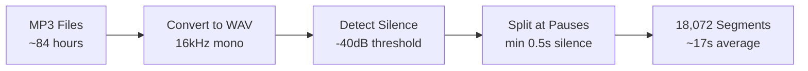
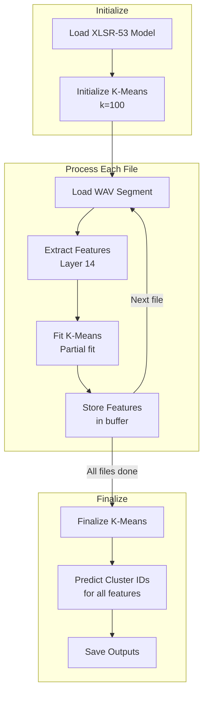
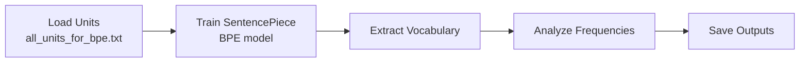
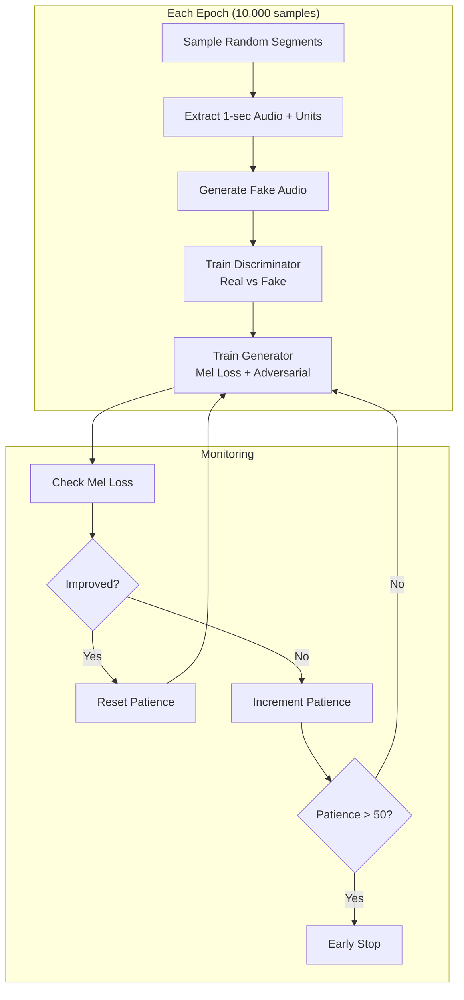

# Pipeline Execution Guide

This document explains how to run each phase of the acoustic tokenization pipeline.

## Prerequisites

### Local Setup

```bash
# Install dependencies
pip install modal torch torchaudio transformers scikit-learn sentencepiece tqdm librosa soundfile

# Authenticate with Modal
python3 -m modal token set --token-id <your-id> --token-secret <your-secret>
```

### Modal Volume

All data is stored in a Modal volume named `bible-audio-data`:

```
/mnt/audio_data/
├── raw_audio/           # Original MP3 files
├── converted_audio/     # WAV files (16kHz mono)
├── segmented_audio/     # Silence-segmented files
├── portuguese_units/    # Phase 1 outputs
├── phase2_output/       # Phase 2 outputs
├── vocoder_checkpoints/ # Phase 3 outputs
└── vocoder_test_output/ # Test results
```

---

## Phase 0: Data Preparation

### Step 0.1: Segment Audio Locally

Segmentation by silence is CPU-intensive and runs better locally.

```bash
python3 scripts/segment_audio.py
```



**Output:** `local_segments/` directory with WAV files

### Step 0.2: Upload to Modal

```bash
python3 -m modal run scripts/upload_to_modal.py
```

**Features:**
- Resume capability (skips already uploaded files)
- Progress bar with ETA
- Batch processing (100 files at a time)

---

## Phase 1: Acoustic Tokenization

### What It Does

1. Loads each audio segment
2. Extracts XLSR-53 features (layer 14)
3. Clusters features using K-Means (100 clusters)
4. Saves unit sequences with timestamps

### Run Command

```bash
# Skip segmentation (use uploaded segments)
python3 -m modal run --detach src/training/phase1_acoustic.py::main_skip_segmentation
```

### Execution Flow



### Outputs

| File | Description |
|------|-------------|
| `portuguese_kmeans.pkl` | Trained K-Means model |
| `portuguese_corpus_timestamped.json` | Unit sequences per file |
| `all_units_for_bpe.txt` | All units as space-separated strings |

### Checkpointing

The script saves checkpoints every 5 minutes:
- `checkpoint.json` - Current state
- `processed_files.txt` - Completed files

Resume automatically if interrupted.

---

## Phase 2: BPE Motif Discovery

### What It Does

1. Loads unit sequences from Phase 1
2. Trains SentencePiece BPE tokenizer
3. Analyzes motif frequencies
4. Saves vocabulary and analysis

### Run Command

```bash
python3 -m modal run --detach src/training/phase2_bpe.py::main
```

### Execution Flow



### Outputs

| File | Description |
|------|-------------|
| `portuguese_bpe.model` | Trained BPE model |
| `portuguese_bpe.vocab` | Vocabulary (unit → token) |
| `motif_analysis.json` | Top motifs with frequencies |

### Vocabulary Size Auto-Adjustment

If requested vocab_size exceeds data capacity:

```python
# Automatic retry with lower vocab size
try:
    train(vocab_size=500)
except RuntimeError as e:
    if "Vocabulary size too high" in str(e):
        max_size = extract_max_from_error(e)
        train(vocab_size=max_size - 10)
```

---

## Phase 3: Vocoder Training

### What It Does

1. Loads unit sequences and corresponding audio
2. Trains Generator (unit → audio) and Discriminator
3. Uses mel spectrogram loss + adversarial loss
4. Saves checkpoints and sample audio

### Run Command

```bash
# Full training with defaults
python3 -m modal run --detach src/training/phase3_vocoder.py::main

# Custom parameters
python3 -m modal run --detach src/training/phase3_vocoder.py::main \
    --epochs 500 \
    --batch-size 16 \
    --patience 50
```

### Training Strategy



### Parameters

| Parameter | Default | Description |
|-----------|---------|-------------|
| `epochs` | 500 | Maximum training epochs |
| `batch_size` | 16 | Samples per batch |
| `lr` | 0.0002 | Learning rate |
| `samples_per_epoch` | 10,000 | Samples per epoch (~2 min) |
| `patience` | 50 | Early stopping patience |
| `min_delta` | 0.5 | Minimum improvement threshold |
| `save_every` | 20 | Checkpoint frequency |

### Outputs

| File | Description |
|------|-------------|
| `vocoder_final.pt` | Final model weights |
| `vocoder_latest.pt` | Latest checkpoint |
| `vocoder_epoch_XXXX.pt` | Periodic checkpoints |
| `sample_epoch_XXXX.wav` | Generated samples |
| `training_log.json` | Loss history |

---

## Testing & Validation

### Vocoder Quality Test

```bash
python3 -m modal run src/training/vocoder_test.py::main --num-samples 20
```

### Metrics Computed

| Metric | Description | Good Value |
|--------|-------------|------------|
| **SNR** | Signal-to-noise ratio | > 5 dB |
| **MCD** | Mel Cepstral Distortion | < 8 |
| **Length Match** | Synth / Original ratio | ~1.0 |

### Download Results

```bash
# Download test audio for listening
python3 -m modal volume get bible-audio-data vocoder_test_output/ ./results/

# Compare files
# results/orig_0000.wav  - Original audio
# results/synth_0000.wav - Synthesized audio
```

---

## Monitoring

### Modal Dashboard

All jobs can be monitored at:
```
https://modal.com/apps/obt-lab/main/
```

### Check Volume Contents

```bash
# List directories
python3 -m modal volume ls bible-audio-data

# List specific directory
python3 -m modal volume ls bible-audio-data vocoder_checkpoints/
```

### Download Outputs

```bash
# Phase 1 outputs
python3 -m modal volume get bible-audio-data portuguese_units/ ./modal_downloads/phase1_outputs/

# Phase 2 outputs
python3 -m modal volume get bible-audio-data phase2_output/ ./modal_downloads/phase2_outputs/

# Vocoder checkpoints
python3 -m modal volume get bible-audio-data vocoder_checkpoints/ ./modal_downloads/vocoder/
```

---

## Troubleshooting

### CUDA Out of Memory

**Symptom:** Training crashes with OOM error

**Solution:** Reduce batch size
```bash
python3 -m modal run --detach src/training/phase3_vocoder.py::main --batch-size 8
```

### Discriminator Collapse (D Loss = 0)

**Symptom:** D loss drops to 0, audio quality degrades

**Cause:** Generator "wins" too easily

**Solutions:**
1. Lower generator learning rate
2. Train D more steps per G step
3. Add gradient penalty

### Early Stopping Too Soon

**Symptom:** Training stops before good quality

**Solution:** Increase patience or decrease min_delta
```bash
python3 -m modal run --detach src/training/phase3_vocoder.py::main --patience 100 --min-delta 0.1
```

### Job Timeout

**Symptom:** Modal job terminates after 4 hours

**Solution:** Use `--detach` and increase timeout in code
```python
@app.function(timeout=43200)  # 12 hours
```
