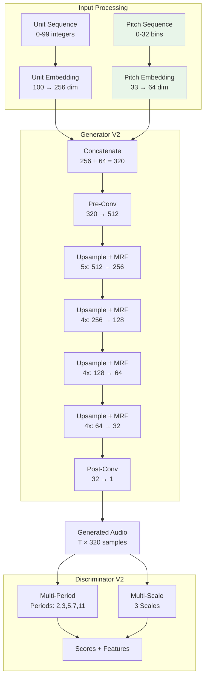
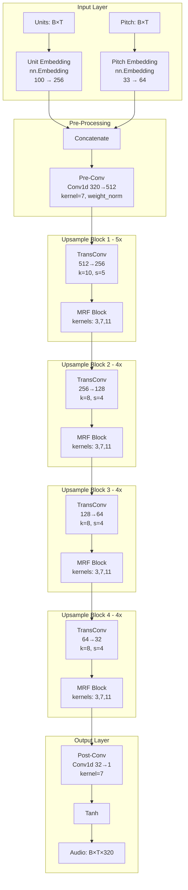
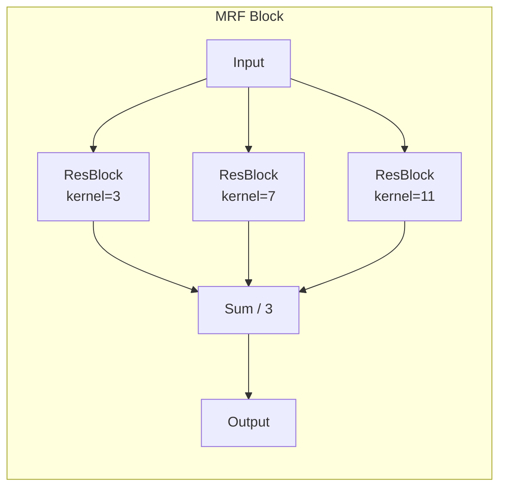
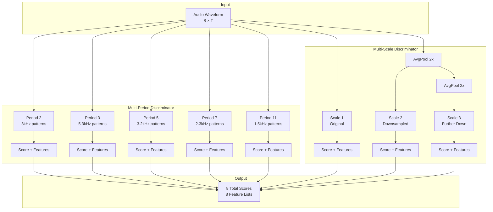
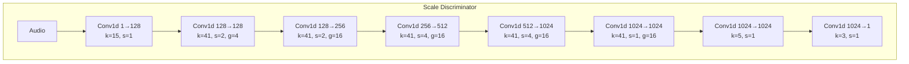
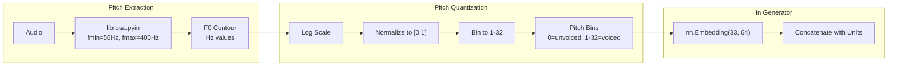
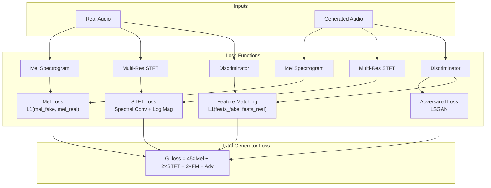
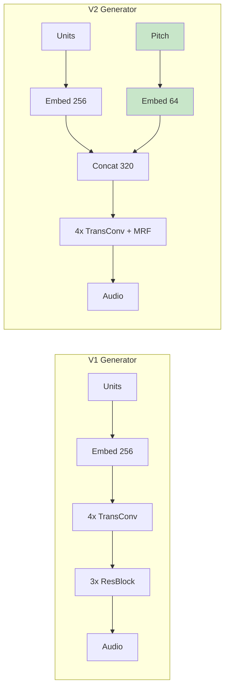

# Vocoder V2: Enhanced Architecture & Implementation

This document provides a comprehensive technical analysis of the V2 vocoder architecture, explaining the design decisions, implementation details, and improvements over V1.

## Table of Contents

1. [Overview](#overview)
2. [Generator V2 Architecture](#generator-v2-architecture)
3. [Discriminator V2 Architecture](#discriminator-v2-architecture)
4. [Pitch Extraction & Conditioning](#pitch-extraction--conditioning)
5. [Loss Functions](#loss-functions)
6. [Training Configuration](#training-configuration)
7. [Comparison: V1 vs V2](#comparison-v1-vs-v2)

---

## Overview

The V2 vocoder is a complete architectural upgrade designed to solve the "robotic audio" problem identified in V1. It introduces **pitch conditioning** and uses a **HiFi-GAN style** architecture.

### High-Level Architecture



### Key Improvements Summary

| Feature | V1 | V2 |
|---------|----|----|
| **Pitch Conditioning** | ❌ None | ✅ 32-bin F0 embedding |
| **Generator Architecture** | Simple TransConv | HiFi-GAN with MRF |
| **Discriminator** | MSD only (3 scales) | MPD (5 periods) + MSD (3 scales) |
| **Normalization** | None | Weight Norm (G) + Spectral Norm (D) |
| **Losses** | Mel + Adversarial | Mel + STFT + FM + Adversarial |
| **Segment Length** | 1 second | 2 seconds |
| **Total Params (G)** | ~3.3M | ~4.5M |
| **Total Params (D)** | ~5.1M | ~15M |

---

## Generator V2 Architecture

The Generator converts discrete acoustic units (with pitch) into continuous audio waveforms.

### Architecture Diagram



### Multi-Receptive Field Fusion (MRF)

The MRF block is the core innovation from HiFi-GAN. It applies multiple residual blocks with different kernel sizes and sums their outputs.



**Why MRF?**
- **Kernel=3**: Captures fine-grained phonetic details (~60 samples = 3.75ms)
- **Kernel=7**: Captures sub-phonemic patterns (~140 samples = 8.75ms)
- **Kernel=11**: Captures phoneme-level patterns (~220 samples = 13.75ms)

### ResBlock with Dilations

Each ResBlock uses multiple dilation rates to increase receptive field without increasing parameters.

```mermaid
flowchart TB
    subgraph ResBlock [ResBlock - Dilated Convolutions]
        IN[Input x]
        
        subgraph Dilation1 [Dilation 1,1]
            D1C1[Conv d=1] --> D1A1[LeakyReLU]
            D1A1 --> D1C2[Conv d=1] --> D1O[Output]
        end
        
        subgraph Dilation2 [Dilation 3,1]
            D2C1[Conv d=3] --> D2A1[LeakyReLU]
            D2A1 --> D2C2[Conv d=1] --> D2O[Output]
        end
        
        subgraph Dilation3 [Dilation 5,1]
            D3C1[Conv d=5] --> D3A1[LeakyReLU]
            D3A1 --> D3C2[Conv d=1] --> D3O[Output]
        end
        
        IN --> D1C1
        D1O --> SKIP1[+ Skip]
        IN --> SKIP1
        
        SKIP1 --> D2C1
        D2O --> SKIP2[+ Skip]
        SKIP1 --> SKIP2
        
        SKIP2 --> D3C1
        D3O --> SKIP3[+ Skip]
        SKIP2 --> SKIP3
        
        SKIP3 --> OUT[Output]
    end
```



### Weight Normalization

All convolutional layers in the Generator use **Weight Normalization**:

```python
self.conv = weight_norm(nn.Conv1d(in_ch, out_ch, kernel_size))
```

**Why Weight Norm?**
- Decouples magnitude and direction of weights
- Faster convergence than Batch Norm
- No running statistics (better for variable-length audio)
- Can be removed at inference for efficiency

---

## Discriminator V2 Architecture

The V2 Discriminator combines two complementary architectures:

### Combined Architecture



### Period Discriminator

The Period Discriminator reshapes 1D audio into 2D based on a period and applies 2D convolutions.


**Why Period Discriminator?**
- Voiced speech is quasi-periodic (pitch period = 1/F0)
- Period 2 at 16kHz → detects 8kHz artifacts
- Period 3 → detects 5.3kHz artifacts
- Prime numbers ensure diverse, non-overlapping patterns

### Scale Discriminator

Each Scale Discriminator uses 1D convolutions at a different audio resolution.



**Why Multi-Scale?**
- Scale 1 (original): Fine details, high-frequency content
- Scale 2 (2x down): Speech rhythm, envelope
- Scale 3 (4x down): Global structure, long-term dependencies

### Spectral Normalization

All Discriminator layers use **Spectral Normalization**:

```python
self.conv = spectral_norm(nn.Conv1d(...))
```

**Why Spectral Norm?**
- Constrains Lipschitz constant of discriminator
- Prevents discriminator from becoming too powerful
- Stabilizes training (prevents mode collapse)
- Maintains D_loss > 0 throughout training

---

## Pitch Extraction & Conditioning

### The Problem

V1 units are **pitch-invariant** because XLSR-53 Layer 14 discards F0 information. The generator has no way to know what pitch to produce.

### The Solution

Extract pitch from source audio and provide it as a conditioning signal.



### Pitch Bin Calculation

```python
def quantize_pitch(f0, num_bins=32, f0_min=50.0, f0_max=400.0):
    # Voiced frames only
    voiced = f0 > 0
    
    # Log-scale for perceptual uniformity
    log_f0 = np.log(np.clip(f0[voiced], f0_min, f0_max))
    log_min, log_max = np.log(f0_min), np.log(f0_max)
    
    # Normalize to [0, 1] then to [1, num_bins]
    normalized = (log_f0 - log_min) / (log_max - log_min)
    bins = (normalized * (num_bins - 1) + 1).astype(int)
    
    # Unvoiced = 0
    result = np.zeros_like(f0, dtype=int)
    result[voiced] = bins
    return result
```

### Pitch Range

| Bin | Frequency Range | Typical Voice |
|-----|-----------------|---------------|
| 0 | Unvoiced | Silence, consonants |
| 1-8 | 50-80 Hz | Very deep male |
| 9-16 | 80-140 Hz | Male speech |
| 17-24 | 140-220 Hz | Female speech |
| 25-32 | 220-400 Hz | Children, high female |

---

## Loss Functions

The V2 training uses a composite loss function with four components.

### Loss Computation Flow



### 1. Mel Spectrogram Loss

```python
def mel_spectrogram_loss(real, fake):
    mel_transform = T.MelSpectrogram(
        sample_rate=16000, n_fft=1024, 
        hop_length=256, n_mels=80
    )
    return F.l1_loss(mel_transform(fake), mel_transform(real))
```

**Purpose**: Ensures phonetic content matches (what is said).

### 2. Multi-Resolution STFT Loss

```python
def stft_loss(real, fake, fft_sizes=[512, 1024, 2048]):
    for fft_size in fft_sizes:
        real_stft = torch.stft(real, fft_size, ...)
        fake_stft = torch.stft(fake, fft_size, ...)
        
        # Spectral Convergence
        sc_loss += ||real_mag - fake_mag||_F / ||real_mag||_F
        
        # Log Magnitude
        mag_loss += L1(log(fake_mag), log(real_mag))
    
    return (sc_loss + mag_loss) / len(fft_sizes)
```

**Purpose**: Captures harmonic structure at multiple time-frequency resolutions.

### 3. Feature Matching Loss

```python
def feature_matching_loss(real_features, fake_features):
    loss = 0
    for real_feat_list, fake_feat_list in zip(real_features, fake_features):
        for real_feat, fake_feat in zip(real_feat_list, fake_feat_list):
            loss += F.l1_loss(fake_feat, real_feat.detach())
    return loss
```

**Purpose**: Stabilizes training by matching intermediate discriminator features.

### 4. Adversarial Loss (LSGAN)

```python
# Discriminator
d_loss = mean((1 - real_scores)^2) + mean(fake_scores^2)

# Generator
g_adv_loss = mean((1 - fake_scores)^2)
```

**Purpose**: Encourages generator to produce realistic audio.

### Loss Weights

| Loss | Weight | Rationale |
|------|--------|-----------|
| Mel | 45.0 | Primary content loss |
| STFT | 2.0 | Harmonic refinement |
| Feature Matching | 2.0 | Training stability |
| Adversarial | 1.0 | Realism |

---

## Training Configuration

### Hyperparameters

```python
# Segment length
segment_length = 32000  # 2 seconds (vs 16000 in V1)
hop_size = 320          # XLSR-53 frame rate
unit_length = 100       # 32000 / 320

# Batch & Learning
batch_size = 12         # Reduced due to larger segments
learning_rate_g = 0.0002
learning_rate_d = 0.0002
betas = (0.8, 0.99)     # Adam betas

# Early Stopping
patience = 100          # Epochs
min_delta = 0.1         # Loss improvement threshold

# Checkpointing
save_every = 25         # Epochs
```

### Training Loop

```mermaid
sequenceDiagram
    participant Data as DataLoader
    participant G as Generator
    participant D as Discriminator
    participant Opt as Optimizers
    
    loop Each Batch
        Data->>G: units, pitch, audio
        
        Note over D: Train Discriminator
        G->>D: fake_audio (detached)
        D->>D: real_scores, fake_scores
        D->>Opt: d_loss.backward()
        Opt->>D: optimizer_d.step()
        
        Note over G: Train Generator
        G->>D: fake_audio
        D->>G: fake_scores, features
        G->>G: Compute all losses
        G->>Opt: g_loss.backward()
        Opt->>G: optimizer_g.step()
    end
```

---

## Comparison: V1 vs V2

### Architecture Comparison



### Expected Quality Improvements

| Metric | V1 (Baseline) | V2 (Expected) | Improvement |
|--------|---------------|---------------|-------------|
| **SNR** | ~0 dB | > 5 dB | Better signal quality |
| **MCD** | ~80+ | < 10 | Much better spectral match |
| **F0 RMSE** | N/A | < 20 Hz | Pitch accuracy |
| **Naturalness** | 1-2/5 | 3-4/5 | Less robotic |

### Run Commands

```bash
# V1 Training (original, simpler)
python3 -m modal run --detach src/training/phase3_vocoder.py::main

# V2 Training (enhanced, recommended)
python3 -m modal run --detach src/training/phase3_vocoder_v2.py::main

# V2 Testing
python3 -m modal run src/training/vocoder_test_v2.py::main --num-samples 50
```

---

## References

- **HiFi-GAN**: [Kong et al., 2020](https://arxiv.org/abs/2010.05646) - Generator architecture
- **MelGAN**: [Kumar et al., 2019](https://arxiv.org/abs/1910.06711) - Multi-scale discriminator
- **PYIN**: [Mauch & Dixon, 2014](https://www.eecs.qmul.ac.uk/~siMDi/papers/2014-ICASSP-pyin.pdf) - Pitch extraction
- **Spectral Norm**: [Miyato et al., 2018](https://arxiv.org/abs/1802.05957) - Discriminator stabilization
